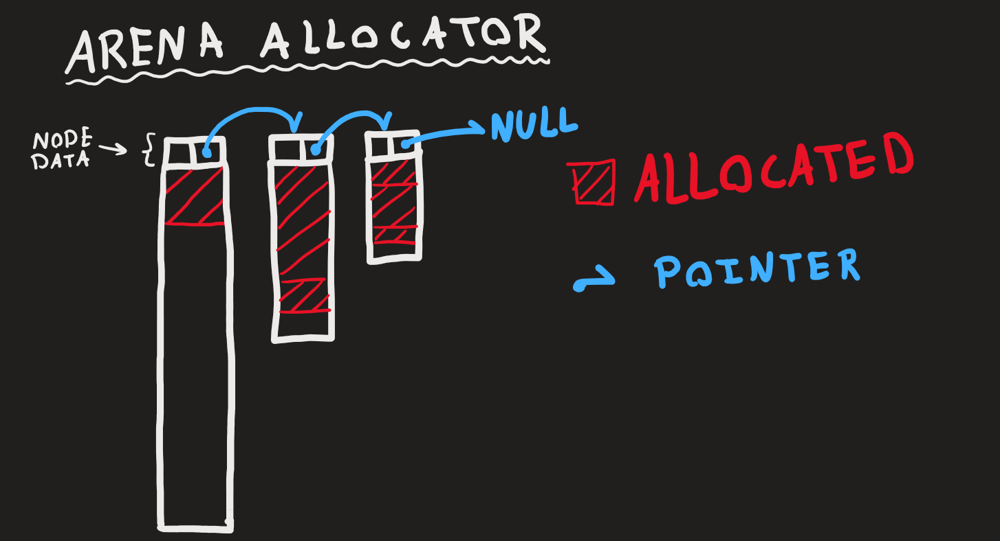
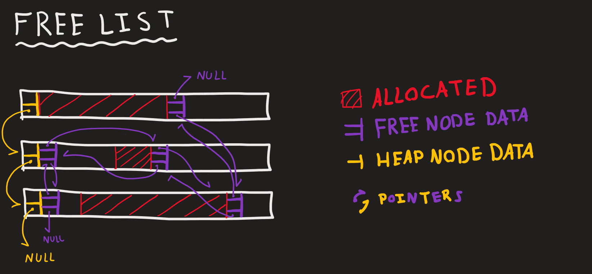

# Azeez Daoud Task 17 - Allocators in Zig
Allocators chosen to implement: Expanding Arena Allocator & Allocator with Free List

# Run the tests
There are tests under [`src/tests.zig`](src/tests.zig) to which you can read then run using `zig test src/tests.zig` while in the main project directory.

# Expanding Arena Allocator
This Allocator starts off with a page sized "heap" (4096 bytes) that can be allocated to. If the heap is filled another one is created and linked to first with a singly-linked-list. The new heap will either have, double the size of the previous one or equal to one that is larger than that. Freeing can only be done on the recently allocated memory (because that just means moving the pointer backwards without affecting anything). Resizing is not supported. Calling it will do nothing. Freeing all memory can be done once using the `deinit` function to which ALL memory is freed at once.

## Visualizing (kinda)
This should look approximately like that

# Allocator with Free List (The Naive Approach)
The Free List implementation will create a heap of a page size to which it appends to a Doubly Linked List and a Singly Linked List. Everytime an allocation is requested it searches through the free nodes and finds the FIRST node FIT for the allocation, returns the requested memory and the residue memory is appended at the end of the List. If an allocation is too big, it will request more memory from the underlying allocator to which it appends as a free node (and as a new heap in the Singly Linked List).

Freeing memory is done by taking that freed memory and appends it as a node in the Doubly Linked List.

Resizing is not supported. Calling it will do nothing.

The Singly Linked List is used to have control over the heaps, mainly when freeing all of them when the allocator is destroyed.

## Visualizing (kinda)
This should look approximately like that. Note that the Free Node pointers are probably more messy than in the image.

